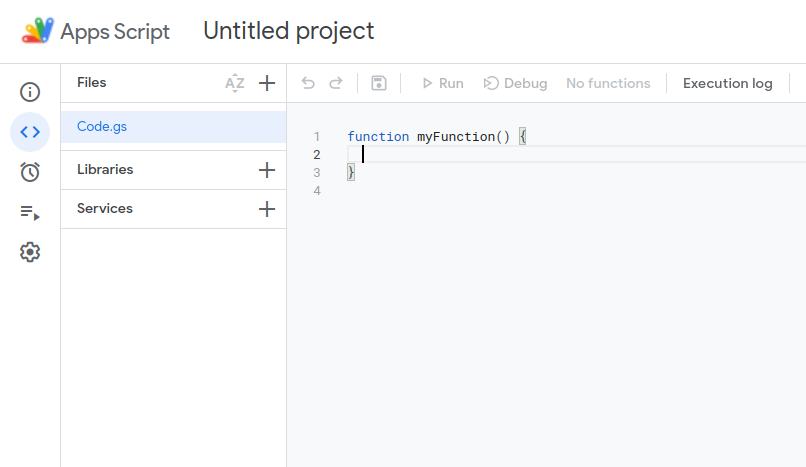
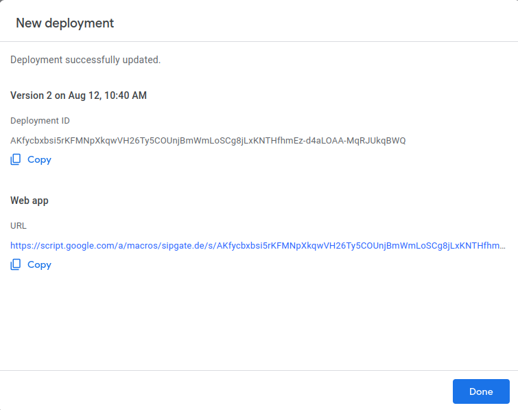

# sipgateio-incomingcall-apps-script


This example demonstrates how to receive and process webhooks from [sipgate.io](https://developer.sipgate.io/) with Google Apps Script.

- [Prerequisites](#Prerequisites)
- [Enabling sipgate.io for your sipgate account](#Enabling-sipgateio-for-your-sipgate-account)
- [How sipgate.io webhooks work](#How-sipgateio-webhooks-work)
- [How to setup an apps script](#How-to-setup-an-apps-script)
- [Configure webhooks for sipgate.io](#Configure-webhooks-for-sipgateio)
- [Execution](#Execution)
- [Common Issues](#Common-Issues)
- [Contact Us](#Contact-Us)


## Prerequisites
- sipgate.io-Account
- Google-Account


## Enabling sipgate.io for your sipgate account
In order to use sipgate.io, you need to book the corresponding package in your sipgate account. The most basic package is the free **sipgate.io S** package.

## How sipgate.io webhooks work

### What is a webhook?
A webhook is a POST request that sipgate.io makes to a predefined URL when a certain event occurs.
These requests contain information about the event that occurred in `application/x-www-form-urlencoded` format.

This is an example payload converted from `application/x-www-form-urlencoded` to json:
```json
{
  "event": "newCall",
  "direction": "in",
  "from": "492111234567",
  "to": "4915791234567",
  "callId":"12345678",
  "origCallId":"12345678",
  "user": [ "Alice" ],
  "xcid": "123abc456def789",
  "diversion": "1a2b3d4e5f"
}
```

### sipgate.io webhook events
sipgate.io offers webhooks for the following events:

- **newCall:** is triggered when a new incoming or outgoing call occurs 
- **onAnswer:** is triggered when a call is answered – either by a person or an automatic voicemail
- **onHangup:** is triggered when a call is hung up
- **dtmf:** is triggered when a user makes an entry of digits during a call

**Note:** Per default sipgate.io only sends webhooks for **newCall** events.
Usually to subscribe to other event types you can reply to the **newCall** event with an XML response. 
Unfortunately Google Apps Script does not support `content-type: application/xml`. Therefore we cannot subscribe to additional event types.
If you need to respond you may refer to our repository [sipgateio-incomingcall-node](https://github.com/sipgate-io/sipgateio-incomingcall-node).

## How to setup an apps script
First navigate to [Google Apps Script](https://script.google.com/home) and create a new project via the button in the upper left corner.
You are redirected to a new unnamed project.

Replace the code in the `Code.gs` with the following: 
```js
function doPost(e) {
    var url = "YOUR_GOOGLE_SPREADSHEET_URL";
    var sheet = SpreadsheetApp.openByUrl(url);
    
    var data = JSON.parse(JSON.stringify(e));
    
    sheet.appendRow(["event: ", "from: ", "to: "]);
    sheet.appendRow([data.parameters.event.toString(), data.parameters.from.toString(), data.parameters.to.toString()]);
}
```
**Info:** *The `doPost`-function will receive the webhook event as an `Object`. We then extract data from this object and store it in a Google Spreadsheet.*

In a new browser tab open your Google Drive. Create a new Spreadsheet and open it. This sheet will log your incoming webhooks. Copy the sheet's URL and paste it into the `"YOUR_GOOGLE_SPREADSHEET_URL"` in your `Code.gs`.

Deploy the script by clicking the blue `Deploy` button in the top right corner. Click `new Deployment`. In the popup window go to `select type` an choose `web app`. Fill out all the necessary information. Make sure to choose `Me` for `execute as` and `anyone` for `who has access`, then click `deploy`. You then need to authorize access.


In case you are notified that the app has not been verified, click on `Advanced` to see the hidden information.
Click on `Go to YOUR_PROJECT`.



In the next popup window copy the web app URL and click `Done`. You may then configure the webhooks at sipgate.io.
## Configure webhooks for sipgate.io 
You can configure webhooks for sipgate.io as follows:

1. Navigate to [console.sipgate.com](https://console.sipgate.com/) and login with your sipgate account credentials.
2. Select the **Webhooks**&nbsp;>&nbsp;**URLs** tab in the left side menu
3. Click the gear icon of the **Incoming** entry
4. Fill in your webhook URL and click save. The webhook URL is the web app URL you copied beforehand.

## Execution
To test your setup make a call to a phonenumber associated with your sipgate-account. The call with the event type, incoming and outgoing phonenumbers is then printed to your spreadsheet.

## Common Issues
### sipgate.de displays "Feature sipgate.io not booked."
Possible reasons are:
- the sipgate.io feature is not booked for your account

See the section [Enabling sipgate.io for your sipgate account](#enabling-sipgateio-for-your-sipgate-account) for instruction on how to book sipgate.io

### Call happened but no webhook was received 
Possible reasons are:
- the configured webhook URL is incorrect
- webhooks are not enabled for the phoneline that received the call
- make sure you are authorized to access the Google Spreadsheet you created
## Contact Us
Please let us know how we can improve this example.
If you have a specific feature request or found a bug, please use **Issues** or fork this repository and send a **pull request** with your improvements.

---

[sipgate.io](https://www.sipgate.io) | [@sipgateio](https://twitter.com/sipgateio) | [API-doc](https://api.sipgate.com/v2/doc)
